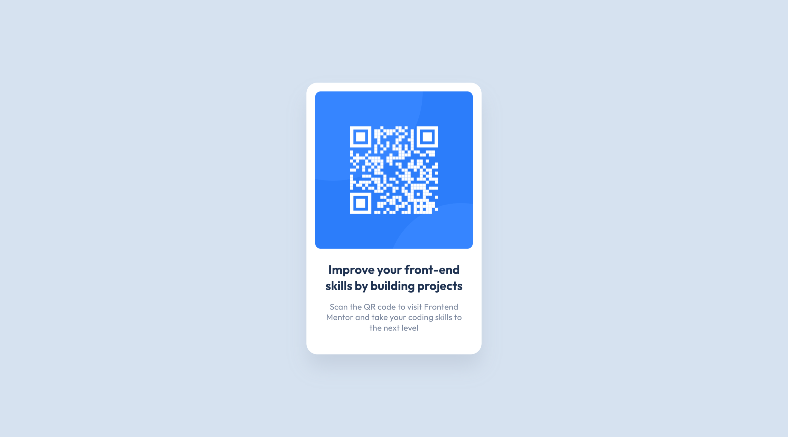

# Frontend Mentor - QR code component solution

This is a solution to the [QR code component challenge on Frontend Mentor](https://www.frontendmentor.io/challenges/qr-code-component-iux_sIO_H).

## Table of contents

- [Overview](#overview)
  - [Screenshots](#screenshots)
  - [Links](#links)
- [My process](#my-process)
  - [Built with](#built-with)
  - [What I learned](#what-i-learned)
  - [Continued development](#continued-development)
  - [Useful resources](#useful-resources)
- [Author](#author)

## Overview

### Screenshots

The desktop design VS My desktop solution 
 

 

The mobile design VS My mobile solution 
 

### Links

- Solution URL: [FrontEnd Mentor: My Solution](https://www.frontendmentor.io/solutions/rotating-qr-card-component-TYJpErvy9)
- Live Site URL: [GitHub Page: QR Card Component](https://anoshaahmed.github.io/fem14-qr-code-card/)

## My process

### Built with

- Semantic HTML5 markup
- CSS custom properties
- Flexbox
- BEM

### What I learned

I learned to make a rotating component.

### Continued development

I want to continue incorporating new things I learn into my FEM projects.

### Useful resources

- [MDN Web Docs: linear-gradient()](https://developer.mozilla.org/en-US/docs/Web/CSS/gradient/linear-gradient()) - This helped me with linear-gradient.

## Author

- Website - [Anosha Ahmed](https://www.anoshaahmed.com)
- Frontend Mentor - [@anoshaahmed](https://www.frontendmentor.io/profile/anoshaahmed)
- LinkedIn - [Anosha Ahmed](https://www.linkedin.com/in/anoshaahmed/)
- Twitter - [@anosha1ahmed](https://www.twitter.com/anosha1ahmed)
